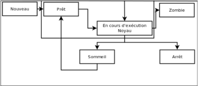

# [Tutoriel Programmation Système](https://openclassrooms.com/fr/courses/1513891-la-programmation-systeme-en-c-sous-unix/1513964-avant-propos)
## Définition: 
* [La programmation système sert à faire fonctionner le pc contrairement à la programmation d'application qui utilise seulement les fonctions du pc](https://openclassrooms.com/fr/courses/1513891-la-programmation-systeme-en-c-sous-unix?status=published#/id/r-1514735)
 * *[La programmation système permet de créer des drivers, communiquer avec les périphériques, voire même créer un système d'exploitation !](https://openclassrooms.com/fr/courses/1513891-la-programmation-systeme-en-c-sous-unix/1513964-avant-propos#/id/r-1514754)*
* On parle ici de couche logicielle et plus précisement de couche d'abstraction matérielle car les programmes de cette couche ont accès aux ressource matérielle du pc.
* C'est par le **noyau** qu'on passe pour demander (appels-système) des infos concernant les programmes de la couche d'abstraction matérielle.
## Première approche: *Les erreurs*
* Vu qu'on travaille avec l'os direct, on va faire face à beaucoupp d'erreur du coup la première étape est de gerer ces erreurs.
* ERRNO
    * utile quand on recoit -1 comme retour d'appel systeme (ça peut être autre que -1 voir doc appel sys)
    * Renvoi le code derreur (lié au descriptif string de l'erreur)
    * `#include <errno.h>`
    * `extern int errno;`
* perror("nomAppel")
    * renvoi nomAppel suivi du descriptif décrit par ERRNO
    * `#include <stdio.h>`
    * `if (fork() == -1) {perror("fork");}`
## PSEUDO-PARALELLISME
* Le micro-processeur va attribuer des ressources à plusieurs programmes en quelque millisecondes. Voila pourquoi user à l’impression que c’est effectué en même temps.
## UN PROGRAMME
C’est une suite d’instruction (statique) qui changent les valeurs des registre, de la pile, etc.
## UN PROCESSUS
C’est l’image des conséquences des instruction d’un programme à un certain moment (dynamique)
## PID: 
* n° de processus, unique dans le système (pour un moment donné)
* lors d’un fork, le père et le fils ont chacun un PID
* si on est dans le fils, le PID du père est le PPID
* Dans la table des processus: les PID (de 0 à 32768) sont attribué à la suite, mais après avoir atteint pid_max alors il recup les premiers process id mort entre temps
## ORGANISATION
Les programme initial lance le process (PID = 1) qui lance tout les autres (dont les démon qui tourne constamment pour offrir des services quand besoin est)
## ETAT

> zombie c’est quand le pere na pas fini
(du coup je sais que le pere peut lire son code avant le fils ce qui crée un zombie car le fils ne sais pas lire le retour du père ?)

Dans la table des process, il y a un block (PCB) qui contient [les caractéristiques](https://openclassrooms.com/fr/courses/1513891-la-programmation-systeme-en-c-sous-unix/1514339-les-processus#/id/r-1514901) utiles à la reprise de l'exécution d’un processus (d’un programme)

 
FORK()
